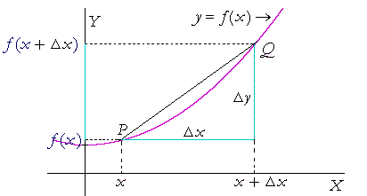
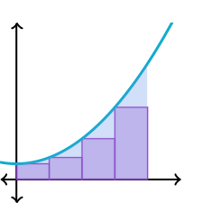

#  CSCI 1103 Computer Science 1 Honors

## Fall 2022

Robert Muller - Boston College

---

## DRAFT Lecture Notes
## Week 6

**Topics:**

1. Some cairns for coding
2. Recursion & Mathematical Induction; Sublists
3. Functions Are Values

---

## 1. Some cairns for coding


1. **Hang in there!** The vast majority of the time you're dealing with code *it isn't working*. Once it works, you'll feel great, and move on to whatever is next. When your code has bugs, well you generally don't know what is going on and it's quite natural to question a lot of things: your ability, the laws of physics, your computer, etc. Forget this stuff and focus on the problem.

2. **Think carefully about the symbolic names you introduce.** When your code is under development and isn't working, you're often poring over your definitions trying to understand what could possibly be wrong. If you use bad names, you're giving your mind yet another hurdle to get over. If you use good names, you're helping yourself understand what is happening.

3. **Think about the kinds of things/values your application needs, consider creating new types for them.** If you do create new types, strongly consider creating string formatting functions for values of the new types. This will be helpful in debugging.

4. **When things get complicated, bail out**. When you're working on some part of your solution and you come across a subproblem that isn't simple, invent a name for a function that will solve that part of the problem for you. You can write that function later. For example, in the best candidate algorithm, it would be natural to have a function say, `bestCandidate : cell list -> cell`, such that a call `(bestCandidate cells)` returns the best candidate to join the cells. In solving such a problem we might write

   ```ocaml
   let bestCandidate cells =
     let candidates = makeCandidates 20
     in
     findBestCandidate candidates cells
   ```

   This approach breaks out the subproblems of making candidates and of finding the best candidate amongst the ones that have been made.

5. **Jot down the type signatures of the functions that you introduce and leave type-correct stubs.** You can circle back and implement them later. For the above, we might write

   ```ocaml
   (* makeCandidates : int -> cell list *)
   let makeCandidates n = []
   
   (* findBestCandidate : cell list -> cell list -> cell *)
   let findBestCandidate candidates cells = makeCell ()
   ```

6. **Be mindful of resource consumption.** How many steps? How much storage? Worst case? Average case?

7. **Let recursion work for you.** See the discussion in the next section.

8. **Adhere to local conventions on formatting.** In this course:

   + operators have spaces on either side;
   + indent two spaces;
   + vertical bars followed by one space;
   + one space after commas, none before;
   + stop short of column 80.
---

## 2. Recursion & Mathematical Induction

Irrespective of language choice, *functions* are the most important tool available to coders for decomposing complex problems into simpler ones. This is true for Java, Python, C, OCaml, all of them. The composition of the smaller functions solves the larger problem. When a problem or subproblem requires some sort of repetition, a *recursive* function will often be the right choice. A call of a recursive function can be thought of as solving a smaller subproblem that is nearly the original problem.

**Example 1:** Consider our first recursive function `length : 'a list -> int`

```ocaml
let rec length xs =
  match xs with
  | [] -> 0
  | y :: ys -> 1 + (length ys)
```

First we identify and resolve the *base cases*, in this case there is just one, when the input list `xs` is empty. If the input list is non-empty, it must be a cons `y :: ys`. We know that `ys` is a list that is the same as `xs` but *smaller*, i.e., it has all of the elements of `xs` other than the first element `y`. So the value resulting from the recursive call `(length ys)` should be understood as the integer length of this slightly smaller list. Let's call that number $N$. With $N$ in hand, the larger problem can now be solved by accounting for `y`, i.e., simply by adding 1 to $N$. In this simple example, it was easy to get from the solution to the smaller problem to the solution to the larger one, but in general, this "solution extension" is usually a little more involved.

**Example 2:** `addToAll : 'a -> ('a list) list -> ('a list) list`

Consider the problem of adding some item to each list in a list `(addToAll x xxs)`.

```ocaml
(* addToAll : 'a -> ('a list) list -> ('a list) list
 *)
let rec addToAll x xxs =
  match xxs with
  | [] -> []
  | ys :: yys -> (x :: ys) :: (addToAll x yys)
```

The same reasoning applies: replacing integer addition `+` with list consing `::`. In particular, we should think of the value of the call `(addToAll x yys)` as having completed the task for all of the lists in `yys`. I.e., we understand the value of `(addToAll x yys)` to be the list of `yys` with `x` having been added to each.

> NB: We'll see a better solution to the `addToAll` problem using `List.map` in a few days.

**Example 3:** `sublists : 'a list -> ('a list) lists`

Consider the problem of computing all of the sublists of a list. For example, the sublists of `[1; 2; 3]` are `[[1; 2; 3]; [1; 2]; [1; 3]; [1]; [2; 3]; [2]; [3]; []]`.

```ocaml
(* sublists : 'a list -> ('a list) list
*)
let rec sublists xs =
  match xs with
  | [] -> [[]]
  | y :: ys ->
    let almost = (sublists ys)
    in
    (addToAll y almost) @ almost
```

After dealing with the single base case where `xs` is `[]`, we are presented with the recursive case when the input list `xs` is a cons `y :: ys`. Again, `ys` is like `xs` but smaller so we can use our `sublists` function recursively in `ys`. For the example list above `[1; 2; 3]`, the value of `(sublists ys)` would be all of the sublists of the list `[1; 2]`, i.e., the value of the variable `almost` would be the list of four lists `[[2; 3]; [2]; [3]; []].` How to get from this answer for this slightly smaller problem to the solution to the bigger problem? Well, all of the elements of the solution to the smaller problem are also in our desired final answer. In addition to these four lists, we need four more lists `[[1; 2; 3]; [1; 2]; [1; 3]; [1]]`. The last line can be understood as extending the solution to the smaller problem to get to the solution to the larger one.

The key idea here is to think: OK, I have in hand a solution to the smaller problem, how can I get from that solution to the solution to the larger problem?

#### Mathematical Induction

The kind of reasoning applied in solving the above problems is long-familiar to mathematicians who might be interested in proving assertions about things that can be placed in order such as the natural numbers
$$
0, 1, 2, 3, ...
$$
The natural numbers have the two properties that 1. they are ordered and 2. *they have a least element* $0$. So one can prove some statement $P$ about *all* natural numbers using [induction](https://en.wikipedia.org/wiki/Mathematical_induction).

>Principle of Mathematical Induction for Natural Numbers
>
>Let $P$ be a statement or proposition about a natural number. We can think of proposition $P$ as having type `nat -> bool`.  Then, if
>
>1. $P(0)$ and
>2. $P(m)$ implies $P(m + 1)$ for every $m$,
>
>then $P$ is true of every natural number.

**Example:** Let $P$ be the statement, for any natural number $n$, the sum $0 + 1 + \ldots + n = \frac{n(n+1)}{2}$.

*Proof*: By induction on the natural numbers. For the base case $n = 0$ we have $0 = \frac{0\cdot(0 +1 )}{2}$. For the induction step, we have the *induction hypothesis* that for some $m$
$$
0 + 1 + \ldots + m = \frac{m(m + 1)}{2}
$$
and we must show the result for $m + 1$, i.e., that
$$
0 + 1 + \ldots + m + (m + 1) = \frac{(m + 1)((m + 1) + 1)}{2}
$$

By the induction hypothesis, the left-hand side can be rewritten as

$$
\frac{m(m + 1)}{2} + (m + 1) = \frac{(m + 1)((m + 1) + 1)}{2}
$$

Multiplying $(m + 1)$ by $2/2$ and then adding like fractions, we have
$$
\frac{m(m + 1)}{2} + (m + 1) = \frac{m(m + 1) + 2(m + 1)}{2}
$$
Factoring the right-hand side yields
$$
\frac{m(m + 1)}{2} + (m + 1) = \frac{(m + 1)(m + 2)}{2}
$$
and finally, because $m + 2 = (m + 1) + 1$ we have the desired result
$$
\frac{m(m + 1)}{2} + (m + 1) = \frac{(m + 1)((m + 1) + 1)}{2}
$$
We conclude that the statement holds for all natural numbers.

The basic ideas are the same: the items are ordered and they have a least element (base case). We can assume the induction hypothesis: that the proposition holds for the smaller case. We must show that under this assumption it holds for the larger case. This topic is taken up in detail in [CSCI 2243 Logic & Computation](https://courses.bc.edu/course/CSCI/2243).

One of the virtues of recursive programming is increased confidence in reasoning about the correctness of the code.

---

##### Example 2: Handling Key Lookup Failures in Maps

The final question on the 2019 midterm exam was the problem of looking up the value of a key in a list of key/value pairs.

```ocaml
[(key1, value1); (key2, value2); ...; (keyN, valueN)]
```

Lists of this kind are called [association lists](https://en.wikipedia.org/wiki/Association_list) or a-lists.  A-lists are a simple but not particularly efficient way of representing a [dictionary]() or map. We'll tend to use the word "map" as they do in Java, in Python the word "dictionary" is preferred. Maps are truly ubiquitous in coding and we'll consider them in more detail a little later.

A simple map with string keys can be specified with the following definitions.

```ocaml
type key = string
type 'a map = (key * 'a) list

val empty : 'a map
val add : key -> 'a -> 'a map -> 'a map
val find : key -> 'a map -> 'a
```

The collection of specifications above is called a [signature](https://caml.inria.fr/pub/docs/manual-ocaml/moduleexamples.html#sec22), another important topic that we'll return to later. For now, note that the latter type definition specifies that maps are polymorphic, relating keys of type `string` to values of any type `'a`. So an `int map` relates strings to integers while a `bool map` relates strings to booleans.

The items `empty` and `add` can be defined simply as

```ocaml
(* empty : 'a map
*)
let (empty : 'a map) = []

(* add : key -> 'a -> ('a map) -> ('a map)
*)
let add key value map = (key, value) :: map
```

> The work performed by `add` is independent of the sizes of the inputs `key`, `value` and `map`. It makes one pair `(key, value)` and one cons. We view its work as requiring just one step.

We can build an `int map` using `empty` together with compositions of calls to `add`.

```ocaml
# let rankings = add "Alice" 100 (add "Bob" 200 (add "Maria" 300 empty));;      
val rankings : int map = [("Alice", 100); ("Bob", 200); ("Maria", 300)]
```

As for `find`, the solution for the first midterm presents the following definition.

```ocaml
(* find : key -> 'a map -> 'a

   (find key map) returns the value of key in map. If key doesn't occur, find fails
   using failwith.
*)
let rec find searchKey map =
  match map with
  | [] -> failwith "find: the key doesn't occur in the map"
  | (key, value) :: map ->
    match searchKey = key with
    | true  -> value
    | false -> find searchKey map
```

> The work performed by `find` is linear in the length of the `map` argument.

When presented with an unknown key, the `find` function fails using `failwith "find: the key ..."`.

```ocaml
# find "Maya" rankings;;
Exception: Failure "find: the key doesn't occur in the map"
```

We'll revise our definition of `find` so that it returns an option instead. If a search key is not in the map, `find` will return `None`, if the search key is in the map with value `v`, `find` will return `Some v`. In revising our definition we'll have to alter only the return type of `find`. The new specification is

```ocaml
type key = string
type 'a map = (key * 'a) list

val empty : 'a map
val add : key -> 'a -> 'a map -> 'a map
val find : key -> 'a map -> 'a option         (* Only this line changed *)
```

We now rewrite `find`.

```ocaml
(* find : key -> ('a map) -> 'a option

   (find key map) returns the an option with the value of key in map.
   If key doesn't occur in the map, find returns None.
*)
let rec find searchKey map =
  match map with
  | [] -> None
  | (key, value) :: map ->
    match searchKey = key with
    | true  -> Some value
    | false -> find searchKey map
```

For example, using our `rankings` map from above, we attempt to find three keys:

```ocaml
# let results = [ (find "Bob" rankings)
                ; (find "Tomas", rankings)    (* NB: key "Tomas" is unknown *)
                ; (find "Maria" rankings)
                ];;
val results : (int option) list = [Some 200; None; Some 300]
```

With `results` as above, we can use pattern matching to capture just the two numerical ranking in `results`. We might write

```ocaml
(* numericalRanks : (int option) list -> int list
*)
let rec numericalRanks options =
  match options with
  | [] -> []
  | None :: options -> numericalRanks options
  | (Some n) :: options -> n :: (numericalRanks options)

# numericalRanks results;;
- : int list = [200; 300]
```

The choice between using options or exceptions will depend on the particulars of the situation. We'll discuss the trade-offs after we've discuss exceptions.

Summing up, we've introduced the last of the 3 major built-in sum types.

1. The `bool` type,

2. the `'a list` type and

3. the `'a option` type.

> **`null`**: In programming languages that don't feature sum types, the symbol `null` is often used to denote "no answer". The `null` symbol is also used as a default value for variables of reference type. In this latter role, it also acts as a base case for recursive types. For example, in Java we might see
>
> ```java
> class Node {        // a recursive type, Node is the type of the next field.
>  int value;
>  Node next;         // default value is null, the implicit base case
> }
> Node p;             // default value of p is null
> ```
>
> The symbol `null` was [introduced](https://www.infoq.com/presentations/Null-References-The-Billion-Dollar-Mistake-Tony-Hoare/) in a dialect of the programming language Algol in the mid-1960s by the [Turing Award](https://en.wikipedia.org/wiki/Turing_Award) winner [Anthony Hoare](https://en.wikipedia.org/wiki/Tony_Hoare). Since then the  `null` infection has spread into all of the languages derivative of the programming language C, including Java. Java programmers spend a lot of time laboring over *null pointer exception* bugs. Java programmers learn to write code fragments
>
> ```java
> if (p != null)
> { ... f(p) ... }
> else
> { ... g(p) ... }
> ```
>
> Note that the function `f` cannot assume that `p` is not `null` even though it is established here by the conditional, the function `f` must check again. Java and C code is littered with superfluous `null` checks because the type systems aren't robust enough to safely omit them.
>
> The `null` symbol does not occur in modern, well-designed programming languages.


---

## 3. Functions Are Values

Types can be understood as denoting sets of values. For example, the literals `1` and `2` are elements of the set denoted by the type `int` and the literals `'A'` and `'B'` are elements of the set denoted by the type `char`. This idea is orthogonal in OCaml: it applies to structured types as well as the base types. Thus, the pair value `(1, 2)` is an element of the set (a *product* set) denoted by the type `int * int`. And so forth.

In this chapter, we consider *function values* i.e., the values occupying the sets denoted by function types. For example, the `square` function in:

```ocaml
(* square : float -> float
*)
let square n = n ** 2.0
```

is of type `float -> float`, so we can usefully think of it as an element of the set denoted by the type `float -> float`. This is a rich and interesting topic and a fundamental aspect of modern coding.

#### Passing Functions as Arguments

Many computational idioms or *patterns* as they are sometimes called, can be captured by treating functions as *first-class* values. That is, by treating functions in the same way that one treats values of other types such as integers, chars or floats — to allow them to be passed as arguments to functions, returned as results of functions, stored in lists, records and tuples and so forth.

##### Example 1: The Slope of a Function

As a first example, consider the problem taken up in pre-calculus math of finding the slope of the line determined by two points $f(x)$ and $f(x + \Delta x)$ for some function $f$ over the reals. You'll recall that the slope is the rise over the run.



We might like to compute the slope for any function $f$, and for any $x$ and any $\Delta x$. We can express this directly in OCaml as follows.

```ocaml
(* slope : (float -> float) -> float -> float -> float
*)
let slope f dx x = ((f (x +. dx)) -. (f x)) /. dx
```

The function `slope` accepts a function `f : float -> float` as its first input parameter. As `dx` approaches $0$, `(slope f dx x)` approaches the slope of the tangent line at $f(x)$.

##### Example 2: The Area under a Curve

A related example from pre-calculus is the problem of finding the area under the curve of a function. The area can be approximated by computing the [Riemann sum](https://en.wikipedia.org/wiki/Riemann_sum), between points $a$ and $b$. You'll recall that the Riemann sum is the sum of the areas of some number of rectangles inscribed under the curve.



The process of adding up the areas of the individual rectangles is a repetitive process that can be expressed recursively.

```ocaml
(* val leftRiemann : (float -> float) -> float -> float -> int -> float

   The call (leftRieman f a b n) divides the area between a and b
   into n equal width intervals. It returns the sum of the areas of those
   rectangles thereby approximating the area under the curve.

   NB: As n grows larger the rectangles become narrower and the
       approximation is closer to the definite integral of f between
       a and b.
 *)
let leftRiemann f a b n =
  let dx = (b -. a) /. (float n) in
  let rec repeat c acc =
    match (Code.closeEnough c b) with
    | true  -> acc
    | false ->
      let height = f c
      in
      repeat (c +. dx) (acc +. height)
  in
  dx *. (repeat a 0.0)
```

> NB: The code computes only the sum of the heights of the rectangles in the loop, waiting to multiply the sum by the fixed width `dx` only after the loop completes. This efficiency can be achieved because multiplication distributes over addition.

As $n$ approaches infinity, `(leftRiemann f a b n)` approaches the area under the curve between $f(a)$ and $f(b)$.

#### Mapping Functions over Lists

One of the most common idioms in functional programming is to produce a list by applying some function to every element of an input list. Consider the polymorphic `pair` function

```ocaml
(* pair 'a -> ('a * 'a) list
*)
let pair x = (x, x)
```

Then we can produce a list of pairs as follows.

```ocaml
(* pairs : 'a list -> ('a * 'a) list
 *)
let rec pairs xs =
  match xs with
  | [] -> []
  | x :: xs -> (pair x) :: (pairs xs)
```

There are many examples fitting this pattern.

```ocaml
(* codes : char list -> int list
*)
let rec codes chars =
  match chars with
  | [] -> []
  | char :: chars -> (Char.code char) :: (codes chars)

(* squares : float list -> float list
 *)
let rec squares ns =
  match ns with
  | [] -> []
  | n::ns -> (square n) :: (squares ns)

(*  lengths : string list -> int list
 *)
let rec lengths strings =
  match strings with
  | [] -> []
  | string :: strings -> (String.length string) :: (lengths strings)
```

All four of these functions accept a list of items and return a new list wherein each element is the image of some function applied to the corresponding element of the input list. For `pairs` that function is `pair`, for `codes` that function is the built-in function `Char.code` and so forth.

We can capture the common pattern by abstracting with respect to the parts that varied in the concrete examples above. The result is the famous `List.map` function:

```ocaml
(* map : ('a -> 'b) -> 'a list -> 'b list
*)
let rec map f xs =
  match xs with
  | [] -> []
  | x :: xs -> (f x) :: (map f xs)
```

>  It's worth taking a moment to carefully consider the type of `map`.

The `map` function is exceedingly useful and is available in the Standard Library's `List` module. Using it, we can rewrite our list processing functions more succinctly as follows:

```ocaml
let squares ns      = List.map square ns
let codes chars     = List.map List.code chars                  (* 1 *)
let lengths strings = List.map String.length strings
let pairs xs        = List.map pair xs                          (* 2 *)
```

The functions `square`, `Char.code` and so forth are passed to the `List.map` function as input arguments.

##### Example: `sublists` Revisited

```ocaml
(* sublists : 'a list -> ('a list) list
*)
let rec sublists xs =
  match xs with
  | [] -> [[]]
  | y :: ys ->
    let almost = sublists ys in
    let newLists = List.map (fun zs -> y :: zs) almost
    in
    newLists @ almost
```


> Heads up! It's worth noting the role of the polymorphism of the `List.map` function. It accepts a function mapping `'a`s to `'b`s and a list of `'a`s. When provided inputs of these types, it returns a list of `'b`s. In the application of map in `(1)` above, the first argument `Char.code`, is of type `char -> int`. Then the second argument is *required* to be a list of `chars`. In the application in `(2)` above, the first argument `pair` is of polymorphic type `'a -> ('a * 'a)`. Thus, the second argument `xs` can be any type `t` and the result wil be a list of pairs of `t`s, i.e., a value of type `(t * t) list` for any type `t`.

#### Iterating over Lists

A *procedure* is a function with return type `unit`. Procedures are one of the *imperative* features in OCaml, they perform some action such as printing or *mutating* memory cells, but they return no meaningful result. The pervasive `print_endline : string -> unit` procedure prints a new-line after printing a string.

The built-in function `List.iter : ('a -> unit) -> 'a list -> unit` when called as in `(List.iter procedure xs)` will apply `procedure` to every element of the list `xs` and return `()` as a result.

```ocaml
# let names = ["Alice"; "Bob"; "Maria"];;
val names : string list = ["Alice"; "Bob"; "Maria"]

# print_endline;;
- : string -> unt = <fun>

# List.iter print_endline names;;
Alice
Bob
Maria
```

**Exercise:** Write the function `List.iter : ('a -> unit) -> 'a list -> unit`.

#### Testing & Filtering Lists

A *predicate* is a function with return type `bool`.  Another common idiom using functions as arguments is to apply a given predicate or test to each element of a list. This might be done for the purpose of determining whether or not all elements of the list pass the test, whether or not *any* element of the list passes the test or for assembling a list of only those elements of the list that pass the test. Respectively, these are the `List.for_all`, `List.exists` and `List.filter` functions.

```ocaml
(* for_all : ('a -> bool) -> 'a list -> bool
*)
let rec for_all test xs =
  match xs with
  | [] -> true
  | x :: xs -> (test x) && (for_all test xs)

(* exists : ('a -> bool) -> 'a list -> bool
*)
let rec exists test xs =
  match xs with
  | [] -> false
  | x :: xs -> (test x) || (for_all test xs)

(* filter : ('a -> bool) -> 'a list -> 'a list
*)
let rec filter test xs =
  match xs with
  | [] -> []
  | x :: xs ->
    let almost = filter test xs
    in
    (match test x with
     | true  -> x :: almost
     | false -> almost)
```

> NB: All three of the above functions are polymorphic.

##### Example: The Sieve of Eratosthenes

[Eratosthenes](https://en.wikipedia.org/wiki/Eratosthenes) was a Greek scholar who lived in Alexandria in the 3rd century BCE. Among his many accomplishments was an efficient method for computing [prime numbers](https://en.wikipedia.org/wiki/Prime_number). Recall that an integer $N$ is prime if its only factors are $1$ and $N$.  A sieve is a screen, when loaded up with seeds and chaff and shaken, the chaff falls through leaving over only the seeds.

Eratosthenes method for computing prime numbers is a repetitive algorithm using the idea of a sieve to compute all of the primes up to $N$. From left to right, eliminate all multiples, the remaining are prime.

1. 2, 3, 4, 5, 6, 7, 8, 9, 10, 11, 12, 13, 14, 15, 16, 17
2. **2**, 3, ~~4~~, 5, ~~6~~, 7, ~~8~~, 9, ~~10~~, 11, ~~12~~, 13, ~~14~~, 15, ~~16~~, 17
3. 2, **3**, ~~4~~, 5, ~~6~~, 7, ~~8~~, ~~9~~, ~~10~~, 11, ~~12~~, 13, ~~14~~, ~~15~~, ~~16~~, 17
4. 2, 3, ~~4~~, **5**, ~~6~~, 7, ~~8~~, ~~9~~, ~~10~~, 11, ~~12~~, 13, ~~14~~, ~~15~~, ~~16~~, 17
5. 2, 3, ~~4~~, 5, ~~6~~, **7**, ~~8~~, ~~9~~, ~~10~~, 11, ~~12~~, 13, ~~14~~, ~~15~~, ~~16~~, 17
6. 2, 3, ~~4~~, 5, ~~6~~, 7, ~~8~~, ~~9~~, ~~10~~, **11**, ~~12~~, 13, ~~14~~, ~~15~~, ~~16~~, 17
7. 2, 3, ~~4~~, 5, ~~6~~, 7, ~~8~~, ~~9~~, ~~10~~, 11, ~~12~~, **13**, ~~14~~, ~~15~~, ~~16~~, 17
8. 2, 3, ~~4~~, 5, ~~6~~, 7, ~~8~~, ~~9~~, ~~10~~, 11, ~~12~~, 13, ~~14~~, ~~15~~, ~~16~~, **17**

We conclude that 2, 3, 5, 7, 11, 13 and 17 are prime. An implementation of Eratosthenes' sieve algorithm is a natural application of `List.filter`.

```ocaml
(* sieve : int -> int list

   The call (sieve n) returns the list of prime numbers less than or equal to n.
*)
let sieve n =
  let ns = List.tl (List.tl (Code.range (n + 1))) in   (* yields [2; ...; n] *)
  let notAFactor m n = n mod m != 0 in
  let rec loop ns answer =
    match ns with
    | [] -> answer
    | m :: ms ->
      let ns = List.filter (fun n -> notAFactor m n) ms
      in
      loop ns  (m :: answer)
  in
  1 :: (loop ns [])
```

#### Folding/Reducing Lists

Yet another common computational pattern involving function arguments and lists is the process of combining the elements of a list together into a single value. For example, we may wish to find the largest integer in a list. This is an easy recursive function, we can use the pervasive function `max : 'a -> 'a -> 'a` as follows.

```ocaml
(* maxList : int list -> int
*)
let rec maxList ns =
  match ns with
  | [] -> min_int
  | n :: ns -> max n (maxList ns)
```

A trace of the simplification of a call `(maxList [4; 2; 3])` shows that the expression simplifies to a 3-way composition of the `max` function.

```ocaml
maxList [4; 2; 3] ->
  match (4 :: [2; 3]) with | [] -> min_int | n :: ns -> max n (maxList ns) ->
  max 4 (max [2; 3] min_int) ->
  ...
  max 4 (max 2 (max 3 min_int)) ->
  max 4 (max 2 3) ->
  max 4 3 ->
  4
```

For still more examples, we may wish to sum a list of floats:

```ocaml
(* addAll : float list -> float
*)
let rec addAll ns =
  match ns with
  | [] -> 0.0
  | n :: ns -> (+.) n (addAll ns)
```

or we may wish to concatenate a list of strings:

```ocaml
(* concatAll : string list -> string
 *)
let rec concatAll strings =
  match strings with
  | [] -> ""
  | string :: strings -> (^) string (concatAll strings)
```

These three examples differ in the result returned for the base case and in the operation applied in the recursive case. We'll abstract with respect to both of these, calling the abstraction `fold`.

```ocaml
(* fold : ('a -> 'b -> 'b) -> 'a list -> 'b -> 'b
*)
let rec fold f xs id =
  match xs with
  | [] -> id
  | y :: ys -> f y (fold f ys id)
```

The `fold` abstraction can be used to write more succinct versions of `maxList`, `addAll` and `concatAll`.

```ocaml
let maxList ns        = fold max ns min_int
let addAll ns         = fold (+) ns 0
let concatAll strings = fold (^) strings ""
```

A call `(maxList [4; 2; 3])` still simplifies to the 3-way composition from above, albeit with 3 intervening calls to `fold`.

```ocaml
maxList [4; 2; 3] ->
  match (4 :: [2; 3]) with | [] -> min_int| y :: ys -> max y (fold max ys min_int) ->
  max 4 (fold max [2; 3] min_int) ->
  ...
  max 4 (max 2 (max 3 min_int)) ->
  max 4 (max 2 3) ->
  max 4 3 ->
  4
```

**Folding Left and Right**

The above version of `fold` is very useful and is available in the `List` module as `List.fold_right`. There is another way to combine the elements of a list with some operator `f`.

```ocaml
(* fold_left : ('a -> 'b -> 'a) -> 'a -> 'b list -> 'a
*)
let rec fold_left (f : 'a -> 'b -> 'a) (id : 'a) (xs : 'b list) : 'a =
  match xs with
  | [] -> id
  | x :: xs -> fold_left f (f id x) xs
```

These two alternatives combine values in different orders. For example, using `a`, `b`, `c` and `d` as values, we see a call of `List.fold_left` simplifies as in:

```ocaml
fold_left f d [a; b; c] ->
  ... ->
  f (f (f d a) b) c
```

For `fold_right` the simplification is:

```ocaml
fold_right f [a; b; c] d ->
  ... ->
  f a (f b (f c d))
```

When the input list to `List.fold_right` has $N$ elements, the result of the fold is an $N$-way composition of the combining function $f$.

> For [associative](https://en.wikipedia.org/wiki/Associative_property) and [commutative](https://en.wikipedia.org/wiki/Commutative_property) functions such as `+`, `*`, `min` and `max` the two folding functions will produce the same result. Since folding left is generally more efficient, it is generally preferred. For functions such as string concatenation `(^)` and list append `(@)` that are associative (i.e., `(a ^ b) ^ c = a ^ (b ^ c)`) but aren't commutative (i.e., in general  `a ^ b != b ^ a`), the two folding functions will only produce the same result if  `id` is the identity value for the function. For concatenation the identity value is the empty string `""` and for list append the identity value is the empty list `[]`. For functions that are neither associative nor commutative, the two folds produce different results.
>
> Heads up! It's worth noting that the floating point operations such as `+.` are generally not associative as one would expect. (!) There are values for which `(a +. b) +. c` is not equal to `a +. (b +. c)`.

The combining operations provided to the fold functions don't require their two inputs to be of the same type, the first argument is of some type `'a` while the second argument is of a possibly different type `'b`. Also, the combining operation for `fold_left` returns a result of the same type as its first argument while the combining operation for `fold_right` returns a result of the same type as its second argument.

```ocaml
fold_left  : ('a -> 'b -> 'a) -> ...
fold_right : ('a -> 'b -> 'b) -> ...
```

##### Example: `maxList` revisited

Since the pervasive `max` function is both associative and commutative, it can be written as either a right fold (as above) or as a left fold.

```ocaml
let maxList ns = List.fold_left max min_int ns
```

For purposes of comparison, it's worth considering the simplification of the version folding to the left.

```ocaml
maxList [4; 2; 3] ->
 match (4 :: [2; 3]) with | [] -> min_int| y :: ys -> fold_left max (max min_int y) ys ->
 fold_left max (max min_int 4) [2; 3] ->
 fold_left max 4 [2; 3] ->
 ... ->
 fold_left max 4 [3] ->
 ... ->
 fold_left max 4 [] ->
 4
```

##### Example: Composing Images

Consider the problem of producing an output image from a list of input images. One could use `Image.place_images` or one could write this as a fold.

```ocaml
type shape = Circle of { x : float
                       ; y : float
                       ; ...
                       }
           | Rectangle ...

let imageOf shape = ...
let backgroundImage : Image.t = ...
let shapes : shape list = [ ... ]                          (* a list of shapes *)

(* addShape : shape -> Image.t -> Image.t
*)
let addShape shape background =
  Image.placeImage (imageOf shape) (shape.x, shape.y) background
```

The type of `addShape` conforms to the type of the first argument of `List.fold_right`. This is a tip-off that we can use `List.fold_right` (but not `List.fold_left`!) to produce a composite image is in:

```ocaml
List.fold_right addShape shapes backgroundImage
```

##### Example: Creating a Map

Let's say we have some high-performance implementation of a key/value map, something more involved than the simple and inefficient a-list representation discussed above. The fancier map still has the familiar types and operations

```ocaml
type key = string
type 'a map = ... something fancy ...

val empty : 'a map
val find : key -> 'a map -> 'a
val add : key -> 'a -> 'a map -> 'a map
```

And let's say that we have a number of key/value pairs stashed away in a list:

```ocaml
let keyvals = [("Alice", true); ("Bob", true); ("Maria", false); ... ]
```

A slight re-packaging of the arguments to `add` would make it easy to add all of the key/values associations to a map. We can write

```ocaml
let buildMap keyvals =
  let addKV (key, value) map = add key value map
  in
  List.fold_right addKV keyvals empty
```

The trick here is that our definition of `addKV` re-packages the arguments for the `add` function. The `add` function requires 3 inputs: a key, a value and a map. The re-packaged version `addKV` requires **two** arguments: a single key/value pair and a map. If we call the type of the key/value pair `'a` and we call the type of the map `'b`, then it is clear that

```ocaml
addKV : 'a -> 'b -> 'b
```

I.e., its type conforms to the type of the first input to `List.fold_right`. A call of `buildMap` would simplify as follows:

```ocaml
buildMap [("Alice", true); ("Bob", true); ("Maria", false)] ->
  ... ->
  add "Alice" true (add "Bob" true (add "Maria" false empty)) ->
  ...
```

##### Example: Sequences over a Set of Symbols

As an example of the use of `List.map` and `List.fold_left`, consider a set of $n$ symbols $A = \{a_1, …, a_n\}$ and the problem of producing all length $k$ sequences of symbols from $A$. As we've noted, there are $n^k$ of them. We write

```ocaml
(* sequencesOver : 'a list -> int -> 'a list list

 The call (stringsOver syms n) returns all length n strings of symbols in syms.
 For example, the call (permutations [0; 1] 2) returns the list

 [[0; 0]; [0; 1]; [1; 0]; [1; 1]].
 *)
let rec sequencesOver symbols n =
  match n = 0 with
  | true  -> [[]]
  | false ->
    let previous = sequencesOver symbols (n - 1) in
    let oneMore  =
      List.map (fun sym -> (List.map (fun seq -> sym :: seq) previous)) symbols
    in
    List.fold_left (@) [] oneMore
```

> Python and JavaScript both feature variations of `List.map` and  `List.fold_left`. In both languages `List.fold_left` is called `reduce`. In JavaScript, `map` and `reduce` are special functions called *methods*, so they are invoked with method-call notation.
>
> ```javascript
> > let a = [1, 2, 3]
> > let add = function (m, n) { return m + n; }
> > a.reduce(add)
> 6
> ```

#### Function Expressions

One of the important properties of OCaml and related languages, is that every type has some expression form that introduces values of the type. For example, the integer literal expression form `6` introduces a value of type `int` and the pair `("Hello", 343)` introduces a value of type `string * int`. But what of the function types, say, `int -> int`? The expression form for introducing values of function type is the `fun` expression:

```ocaml
(fun pattern -> expression)
```

For example, we can type

```ocaml
# (fun n -> n ** 2.0);;
- : float -> float = <fun>
```

The familiar notation for defining the `square` function

```ocaml
let square n = n ** 2.0
```

is actually short-hand for

```ocaml
let square = (fun n -> n ** 2.0)
```

The `fun` expressions are sometimes called *anonymous functions*, anonymous because they have no name. They are useful in many settings, they are commonly used as arguments to `List.map`. For example, if we wanted to pair each element of a list `xs` with some `item`, we might write

```ocaml
let pairAll xs item = List.map (fun x -> (x, item)) xs
```

#### Currying

Continuing our discussion of function expressions, the familiar definition of the "two-argument"  `add` function

```ocaml
let add m n = m + n
```

can instead be written with explicit `fun` expressions as

```ocaml
# let add = (fun m -> (fun n -> m + n));;
val add : int -> int -> int = <fun>
```

Note that `add` is actually a one-argument function. (!) Given an integer for `m`, `add` returns a function `(fun n -> m + n)`. In fact, all functions in OCaml and related languages are functions of one argument. This is easier to see if we explicitly parenthesize the type `int -> int -> int` and a call `add 2 3`. The type is parenthesize associating to the right `int -> (int -> int)` while the call associates to the left `((add 2) 3)`.

##### Partial Application

Even though from the definition `let add m n = m + n`, the function `add` appears to require two arguments, it can be applied to one argument at a time.

```ocaml
# let increment = add 1;;
val increment : int -> int

# increment 342;;
- : int = 343
```

##### Example: `squares` revisited

Earlier on we defined two implementations of a `squares` function. The first used explicit recursion, the second using `List.map`.

```ocaml
# let squares ns = List.map square ns;;
val squares : float list -> float list
```

Since `List.map` has type `('a -> 'b) -> 'a list -> 'b list`, instead of defining our `squares` function as above, we can define it simply by applying `List.map` to only the squaring function.

```ocaml
# let squares = List.map square;;
val squares : float list -> float list
```

> It's worth taking a minute to wrap your head around the above definition. If you don't understand it, see a staffer.

##### Example: The Slope of the Tangent Line of $n^2$

The `slope` function defined above is of type `(float -> float) -> float -> float -> float` and our `square` function is of type `float -> float`. Then

```ocaml
# let squareTangentSlope = slope square 1e-10;;
val squareTangentSlope : float -> float = <fun>

# squareTangentSlope 3.0;;
- : float = 6.00000049644222599
```

> The word "Currying" refers to the surname of the American logician [Haskell Curry](https://en.wikipedia.org/wiki/Haskell_Curry). Haskell Curry's name is well-known by parts: by first-name he is the namesake of the functional programming language [Haskell](https://www.haskell.org/) and by surname he is the namesake of one-argument-at-a-time functions. His surname is also the name of Curry College in Milton, MA. The latter is named after it's founder Amos Silas Curry, Haskell Curry's father.

> **MapReduce** No discussion of mapping and folding/reducing would be complete without at least a reference to [mapReduce](https://en.wikipedia.org/wiki/MapReduce), a programming model based on a composition of `map` and `fold/reduce` for processing large datasets in parallel. A discussion of the details of mapReduce are beyond the scope of this course.
